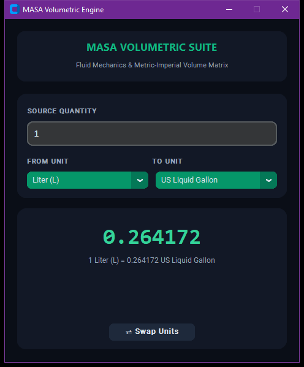

# MASA Volumetric Suite

A fluid mechanics and dimensional volume conversion tool providing unit translation across Metric and Imperial volume standards.

## Technical Architecture

The codebase follows modular software engineering patterns and OOP structure, designed for reliability, high maintainability, and clean separation of concerns:

- **Component Layering**: User interface and computational state are decoupled into specialized controllers and event loops.
- **Defensive Engineering**: Comprehensive validation guards protect against malformed inputs and runtime exceptions.
- **Modern Design Tokens**: Designed with a high-contrast dark aesthetic adhering to modern developer tooling visual standards.


## Preview


## Features

- Comprehensive dimensional unit catalog covering Liters, Milliliters, Cubic Meters, Gallons, Cups, and Fluid Ounces.
- Normalized floating-point conversion algorithm anchored to 1.0 Liter baseline standard.
- Bidirectional unit swapping routine enabling instantaneous ratio inversion.
- Precision formatted string output reflecting calculated conversion formulas.

## Prerequisites

- Python 3.10 or higher
- Required packages:

```bash
pip install customtkinter
```

## Execution

Initialize and run the module via the command line:

```bash
python "Complete Volume Convert in Python/index.py"
```

## Project Structure

```
.
├── Complete Volume Convert in Python
├── LICENSE             # MIT License
└── README.md           # Developer documentation
```

## License

This project is licensed under the terms of the MIT License. Refer to the `LICENSE` file for details.

---

### 🌐 Connect with Me

<p align="left">
  <a href="http://xrefs0.com/" target="_blank">
    
  </a>
  <a href="https://www.facebook.com/XREFS0" target="_blank">
    
  </a>
  <a href="https://t.me/MrMasaOfficial" target="_blank">
    
  </a>
  <a href="https://t.me/XREFS0_CHANNEL" target="_blank">
    
  </a>
  <a href="https://www.youtube.com/@XREFS0" target="_blank">
    
  </a>
</p>

